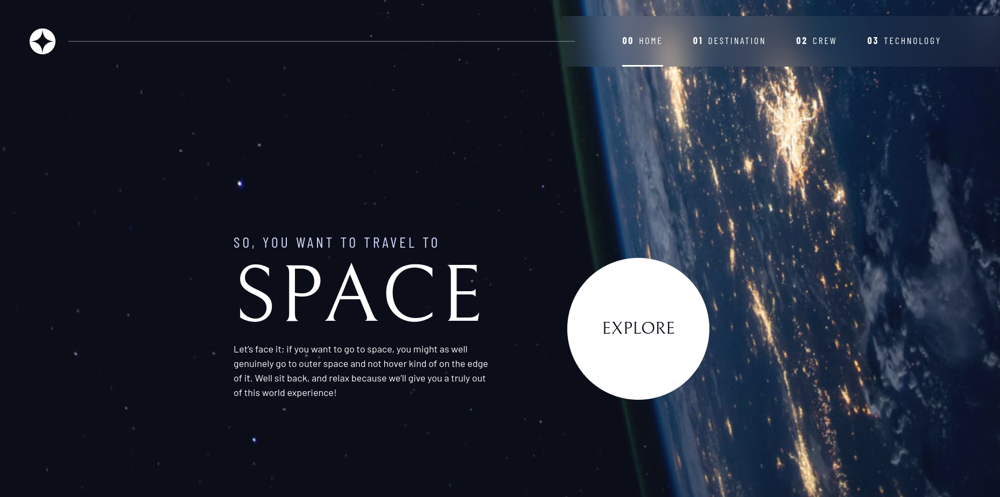

# Frontend Mentor - Space tourism website solution

This is a solution to the [Space tourism website challenge on Frontend Mentor](https://www.frontendmentor.io/challenges/space-tourism-multipage-website-gRWj1URZ3). Frontend Mentor challenges help you improve your coding skills by building realistic projects. 

## Table of contents

- [Overview](#overview)
  - [The challenge](#the-challenge)
  - [Screenshot](#screenshot)
  - [Links](#links)
- [My process](#my-process)
  - [Built with](#built-with)
  - [What I learned](#what-i-learned)
  - [Useful resources](#useful-resources)
- [Author](#author)
- [Acknowledgments](#acknowledgments)

## Overview

### The challenge

Users should be able to:

- View the optimal layout for each of the website's pages depending on their device's screen size
- See hover states for all interactive elements on the page
- View each page and be able to toggle between the tabs to see new information

### Screenshot

### Links
- Live Site URL: [here](https://rigneymade-space.netlify.app/)

## My process

### Built with

- Semantic HTML5 markup
- CSS custom properties
- Flexbox
- CSS Grid
- Mobile-first workflow
- [React](https://reactjs.org/) - JS library

### What I learned

- Following along with Kevin Powell's process, where he used basic HTML, CSS and JS, I learned how to visualize and convert that process into a React one
- The usefulness and necessity (in terms of accessibility) of aria attributes
- How to approach a design starting with CSS first and how it forces you to really plan out the many intricicies of the website
- The use of CSS utility classes and when best to use them
- How to provide various image options to improve performance via the picture element

### Useful resources

- [Kevin Powell](https://www.kevinpowell.co/) - I have learned so much in regards to approach, planning and countless CSS tips watching Kevin approach this project

## Author

- Website - [RigneyMade](https://www.rigneymade.com)
- Frontend Mentor - [@KramYengir](https://www.frontendmentor.io/profile/KramYengir)
- LinkedIn - [Mark Rigney](www.linkedin.com/in/mark-rigney-640992b6)

## Acknowledgments

Again, [Kevin Powell](https://www.kevinpowell.co/), he provides invaluable advice and knowledge regarding CSS. I've learned a lot just by watching how he approached this project.

